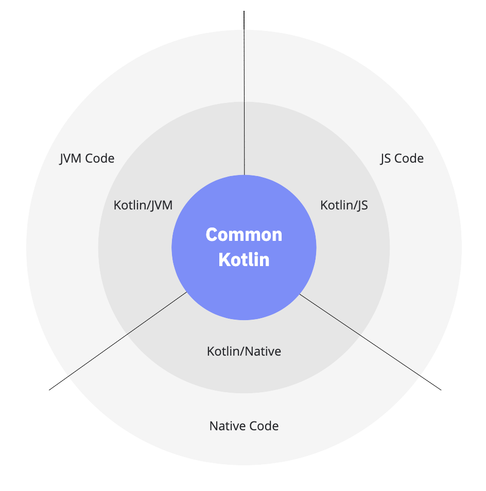

## Libs/Hackernews

This module is the core of the KNews app. It contains the shared logic for both iOS and Android and
exposed it as a ViewModel that could be used (or wrapped) by the client module. Inside the core, it
is a Redux-power Store that expose the UiState as Flow<UiState>.

### Folder structure



```none
└── src
    ├── androidMain
    │ ├── AndroidManifest.xml
    │ └── kotlin
    ├── androidTest
    │ └── kotlin
    ├── commonMain
    │ └── kotlin
    ├── commonTest
    │ └── kotlin
    ├── iosMain
    │ └── kotlin
    └── iosTest
        └── kotlin
```

The core code lies in the common* folder structure. It includes language, core libraries, and basic
tools that works for all platforms. To interop with a platform specific code, code that is placed in
the `androidMain` and `iosMain` is used for that.

### Redux Store

Redux store contains the logic of each screen, the data is flow unidirectional by coming into the
ViewModel as an Action and return out from the ViewModel as a stream (Flow) of UiState.

```none
┌──────────────────────────────────┐
│                UI                │       
└──────▲───────────────────┬───────┘
 Flow  │                   │ Action       
┌──────┴───────┐    ┌──────▼───────┐
│    State     │    │    Store     │       
└──────▲───────┘    └──────┬───────┘
       │                   │        
┌──────┴───────┐    ┌──────▼───────┐
│  Middleware  │<---│   Reducer    │
└──────────────┘    └──────────────┘                  
```

### Implementation

Let's take about the List screen. We have all of the Redux supported class for our ListScreen and
they are all placed inside in one
file [HackerNewsList](src/commonMain/kotlin/com/github/kittinunf/hackernews/api/list/HackerNewsListStore.kt)

The classes are `ListUiRowState`, `ListAction`, `ListReducer`, `ListEnvironment`
, `ListDataMiddleware`. The ViewModel classes that is being exposed to the client
are `HackerNewsListViewModel` inside the androidMain folder (because it requires Android dependency
such as AAC ViewModel) and `HackerNewsListViewModel` inside the iosMain folder.

### Unit tests

With this strategy, we are able to write test code inside of the commonTest folder that will be run
twice (to be exactly correct it will be run thrice (1 time for Android, and 2 more times for iOS (
X64 + arm64) ) ). Our main strategy is to try to put test to be inside of the commonTest folder as
much as possible.

Main test classes are ReducerTest/StoreTest and MapperTest. Overall, we have around 50+ test cases
for the core logic of the app. Please take a look at the test report generated by gradle
test [file](./build/reports/tests/allTests/index.html).

